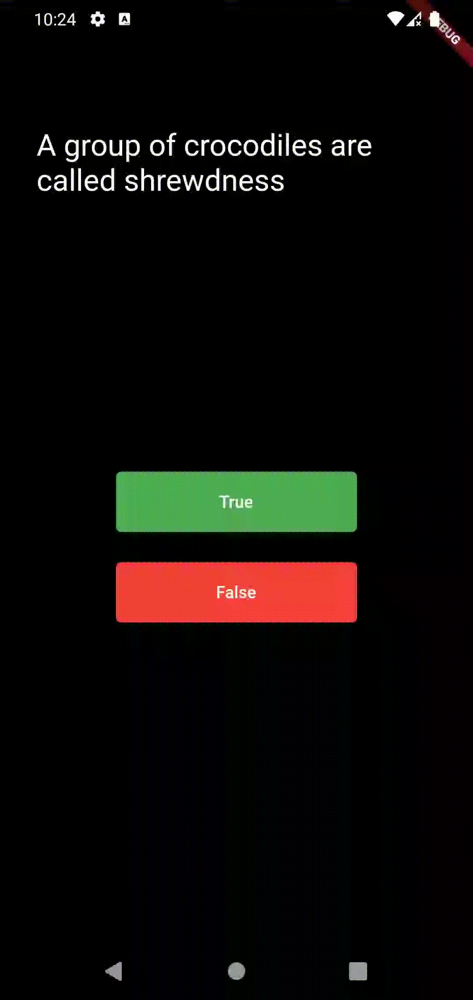

# تطبيق بيانو بسيط (أيفون و أندرويد)

## الوصف:

- تطبيق تم إنشاؤه يعمل بنظام الأندرويد والأيفون.
- يعرض التطبيق العديد من الأسئلة لحلها ويظهر هل قام المستخدم بحل السؤال بشكل صحيح أم لا ثم بعد ذلك يعرض كم الأسئلة الصحيحة التي تم حلها.

## صور التطبيق:

# Simple Piano App (iOS & android)

## Description:

- A Flutter project.
- It is created for iOS & android.
- The application displays many questions to solve and shows whether the user solved the question correctly or not, and then displays the number of correct answers.

## Application images:

